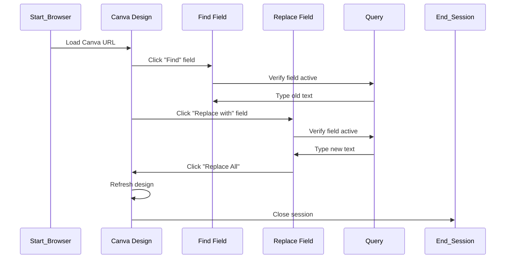
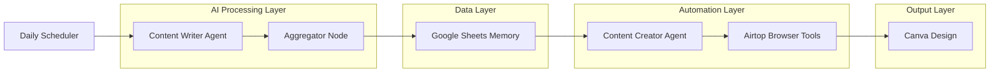

# AI-Powered Daily Canva Content Update Workflow

> **Automated AI-driven content update system** that scrapes daily news, enhances it using Gemini 2.5 Flash, structures it, and updates a Canva design automatically every day at 11:00 PM using Airtop’s AI browser automation tools.

---
ppt link: https://www.canva.com/design/DAG3bpwZ_f8/Ap4yuX5NG-xwhAV25au_KQ/edit

## Overview

This project automates the process of daily content updates in a Canva design.  
It fetches top news, refines the text, formats it, retrieves old design data, and replaces old content with new text inside Canva — **without human intervention**.

### Goals
- Automate daily social/news post updates.
- Maintain content accuracy and consistency.
- Minimize manual effort in Canva.
- Achieve reliable, repeatable browser automation using guardrails.

---

## High-Level Workflow

At 11:00 PM daily, the workflow executes the following steps:

1. **Trigger:** Starts automatically via the scheduler (e.g., n8n).
2. **Content Writer Agent:** Scrapes top 3 news and refines them using *Gemini 2.5 Flash*.
3. **Aggregator (Code Node):** Structures and validates the AI output.
4. **Sheets Node:** Stores and retrieves old/new data.
5. **Content Creator Agent:** Opens Canva via Airtop browser automation and updates the design using find-and-replace operations.

---
## Workflow Diagram


## High-Level Architecture Diagram


## 🔧 Low-Level Workflow Details

### Step 1 — Trigger

* Executes automatically every night at **11:00 PM**.
* Initiates workflow sequence in **n8n**.

### Step 2 — Content Writer Agent

* Scrapes top 3 trending news from reliable sources.
* Uses **Gemini 2.5 Flash** to rewrite and summarize headlines.
* Outputs structured JSON:

  ```json
  {
    "date": "01.11",
    "day": "SAT",
    "news1": "OpenAI launches new multimodal tools for creators.",
    "news2": "Tesla introduces AI-powered battery optimizer.",
    "news3": "Google unveils Gemini 2.5 Flash for real-time tasks."
  }
  ```

### Step 3 — Aggregator Node

* Validates and formats AI output.
* Converts text into structured data for Sheets node.
* Handles missing/empty fields gracefully.

### Step 4 — Sheets Node

* Retrieves **existing Canva content** (yesterday’s data).
* Stores **newly generated content**.
* Provides both to the **Content Creator Agent**.

### Step 5 — Content Creator Agent

* Receives:

  * Old data → from Google Sheets
  * New data → from Aggregator
* Uses **Gemini 2.5 Flash + Airtop browser automation tools** to:

  * Open Canva design.
  * Execute find-and-replace operations for date, day, and 3 news paragraphs.
  * Verify completion before ending session.

---

## Tools & Technologies Used

| Tool                       | Purpose                 | Description                                           |
| -------------------------- | ----------------------- | ----------------------------------------------------- |
| **Gemini 2.5 Flash (LLM)** | Text enhancement        | Generates and refines daily content.                  |
| **Airtop AI Browser**      | Canva UI automation     | Executes find, replace, and refresh tasks in Canva.   |
| **n8n Workflow Engine**    | Workflow orchestration  | Automates daily trigger and data flow.                |
| **Google Sheets Node**     | Data persistence        | Acts as a long-term memory for content updates.       |
| **Aggregator (Code Node)** | Structuring JSON output | Ensures uniform and validated data for further nodes. |
| **Canva Design**           | Visual template         | Destination for all automated content updates.        |

---

## Browser Automation Toolset (Airtop)

| Tool              | Function                    | Notes                                  |
| ----------------- | --------------------------- | -------------------------------------- |
| **Start_Browser** | Initialize browser session  | Call **only once** per run.            |
| **Load_URL**      | Load or reload Canva design | Wait 5 seconds post-load.              |
| **Click**         | Click UI elements           | Wait 3 seconds post-click.             |
| **Type**          | Enter text                  | Wait 2 seconds post-type.              |
| **Query**         | Verify UI and text states   | Use before & after each typing action. |
| **End_Session**   | Close session safely        | Always called, even on failure.        |

---

## Canva Replacement Flow



Each operation set (date, day, news1, news2, news3) follows this pattern.

---

## Guardrails & Best Practices

| Category              | Rule                                                          | Rationale                     |
| --------------------- | ------------------------------------------------------------- | ----------------------------- |
| **Session Control**   | Call `Start_Browser` **once**, and `End_Session` at the end.  | Prevents duplicate sessions.  |
| **Timing**            | Respect wait times (`Click`: 3s, `Type`: 2s, `Load_URL`: 5s). | Ensures UI stability.         |
| **Verification**      | Always `Query` before typing.                                 | Avoids wrong field inputs.    |
| **Retries**           | Retry once if `Click` or `Query` fails.                       | Improves resilience.          |
| **Critical Failures** | End session immediately and log.                              | Maintains workflow integrity. |

---

## Handoffs Between Nodes

| From                     | To                        | Data Transferred              | Purpose                  |
| ------------------------ | ------------------------- | ----------------------------- | ------------------------ |
| **Content Writer Agent** | **Aggregator**            | AI-generated JSON (news data) | Structuring & validation |
| **Aggregator**           | **Sheets Node**           | Clean data                    | Long-term storage        |
| **Sheets Node**          | **Content Creator Agent** | Old + new data                | Canva replacement        |

---

## Memory & Persistence

| Type           | Stored In                                                               | Description                                                      |
| -------------- | ----------------------------------------------------------------------- | ---------------------------------------------------------------- |
| **Short-Term** | Runtime session                                                         | sessionId, windowId, current data                                |
| **Long-Term**  | Google Sheets                                                           | Keeps daily updates (date, day, headlines, timestamp, Canva URL) |
| **Usage**      | Next day’s workflow reads old data from Sheets for replacement in Canva |                                                                  |

---

## System Architecture Diagram



---

## Resources Used

* **Gemini 2.5 Flash** — Text generation & summarization.
* **Airtop** — Browser automation environment.
* **Google Sheets API** — Persistent content memory.
* **Canva API/UI** — Design update interface.
* **n8n** — Workflow orchestration & scheduling engine.

---

## Key Outcomes

* Fully automated **daily content updates** in Canva.
* No human interaction needed after setup.
* **Verified browser actions** for stable UI control.
* Scalable, modular, and reusable across multiple Canva templates.

---

## Future Enhancements

* Add image updates (based on trending topics).
* Include sentiment-based headline selection.
* Support for multilingual content updates.
